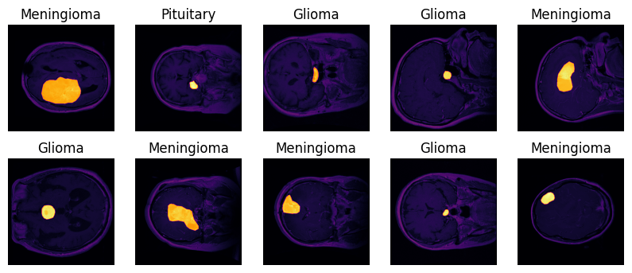

# Deep Learning

## Dataset
Dataset has two channels; MRI and segmented tumor

## Results

|                Model                 | Train loss | Val Loss | Train Acc | Val Acc | Paramers |
|--------------------------------------|------------|----------|-----------|---------|----------|
|   BrainNet A V3 Lr(1e-3) Wr(1e-6)    |   0.033    |  0.035   |   0.988   |  0.989  |  427339  |
|    BrainMobile Lr(1e-4) Wr(1e-8)     |   0.004    |  0.018   |   1.000   |  0.993  | 2227715  |
|   Brainnet B v4 Lr(1e-3) Wr(1e-6)    |   0.016    |  0.037   |   0.996   |  0.992  |  403987  |
| Brainnet GoogleNet Lr(1e-4) Wr(1e-8) |   0.004    |  0.028   |   1.000   |  0.992  | 5602979  |
|   Brainnet C v1 Lr(1e-3) Wr(1e-6)    |   0.016    |  0.034   |   0.996   |  0.989  |  413047  |
|  Brainnet ResNet Lr(1e-4) Wr(1e-8)   |   0.016    |  0.066   |   0.997   |  0.979  | 23514179 |